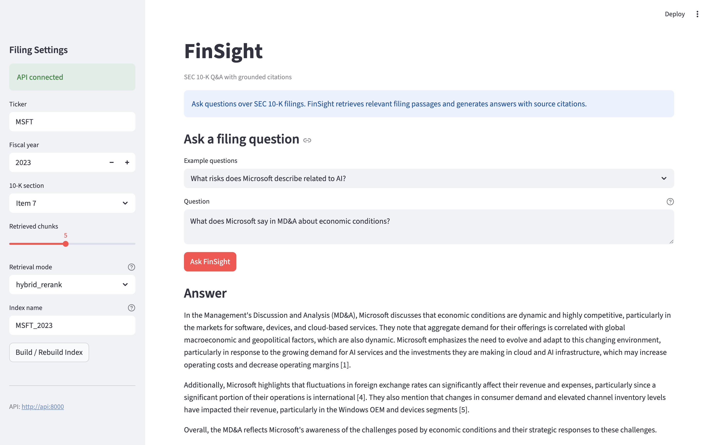
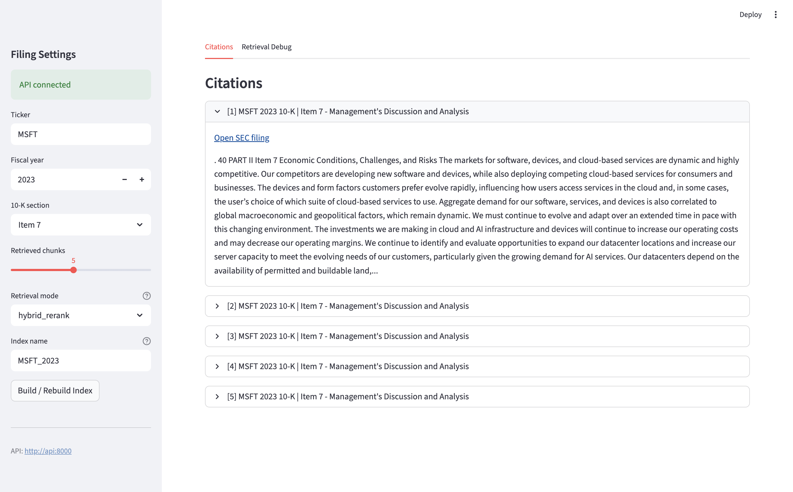
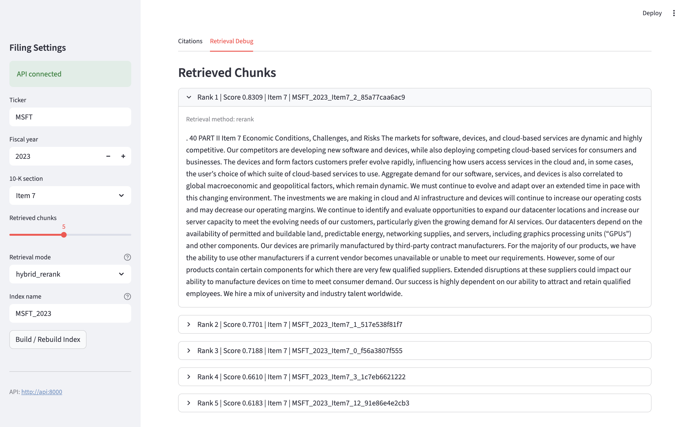
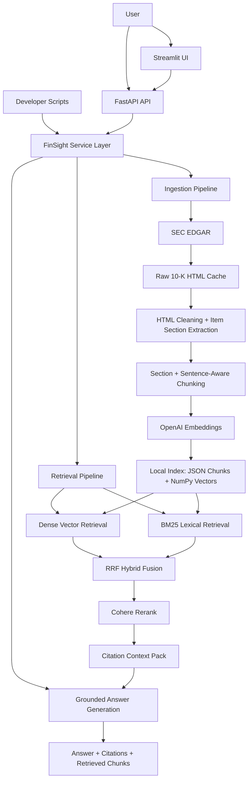

# FinSight


> A RAG-powered SEC 10-K research assistant. Ask grounded questions over real company filings and verify answers with citations traced back to filing sections.

FinSight is a standalone AI research tool for SEC filings. It ingests 10-K filings from SEC EDGAR, extracts major filing sections, builds a local retrieval index, retrieves relevant filing passages, and generates citation-backed answers.

It is also designed so it can later plug into a broader [AI Investment Copilot](https://github.com/Andrewchenyh/ai-investment-copilot) as a dedicated filing research service.

---

## What It Does

Ask a question like:

> What cybersecurity risks does Microsoft describe in its 2023 10-K?

FinSight:

1. Retrieves relevant passages from the indexed 10-K
2. Generates a grounded answer using only retrieved filing excerpts
3. Returns citations with ticker, year, filing type, section, source URL, and excerpt
4. Exposes the workflow through scripts, FastAPI, and a Streamlit demo UI

Example answer shape:

```text
Answer:
Microsoft describes cybersecurity risks including evolving threats, vulnerabilities
in products and services, possible data breaches, supply chain cyberattacks, and
customer reliance on cloud infrastructure security [1][2][3].

Citations:
[1] MSFT 2023 10-K - Item 1A - Risk Factors
[2] MSFT 2023 10-K - Item 1A - Risk Factors
[3] MSFT 2023 10-K - Item 1A - Risk Factors
```

---

## Demo Preview

### Grounded Filing Q&A



### Citation Review



### Retrieval Debug View



---

## Architecture



End-to-end flow:

```text
ticker + fiscal year
  -> CIK lookup
  -> SEC submissions metadata
  -> 10-K source URL
  -> raw HTML download/cache
  -> clean filing text
  -> extract Item sections
  -> section- and sentence-aware chunks
  -> OpenAI embeddings
  -> local vector index
  -> dense/BM25/hybrid retrieval
  -> Cohere rerank
  -> grounded answer generation
  -> citations
```

---

## Why Section-Aware Chunking

Most RAG demos split documents by arbitrary token windows. SEC 10-Ks have legally meaningful structure:

- Item 1: Business
- Item 1A: Risk Factors
- Item 7: Management's Discussion and Analysis
- Item 7A: Market Risk
- Item 8: Financial Statements

FinSight extracts these sections first, then chunks within each section. This preserves provenance and makes citations more useful.

Within a section, the chunker also prefers readable sentence boundaries:

- a chunk end moves back to a nearby newline, period, or semicolon when doing so still leaves a useful amount of text
- the next chunk starts at the beginning of the sentence containing the proposed overlap point
- if no sentence boundary is available, the chunker falls back to a word boundary so it can always make forward progress

This uses the configured overlap as a target while reducing the partial words and sentence fragments produced by arbitrary fixed windows. Character offsets are adjusted with the boundaries, so each excerpt still maps back to the filing text.

Each chunk carries metadata such as:

```text
ticker
company
CIK
accession number
fiscal year
filing type
section
section title
source URL
character offsets
estimated token count
```

Chunking behavior is covered by `backend/tests/test_chunker.py`.

---

## Retrieval Modes

FinSight supports four retrieval modes:

| Mode | Description |
|---|---|
| `dense` | OpenAI embedding retrieval over local chunk vectors |
| `bm25` | Keyword-based lexical retrieval |
| `hybrid` | Dense + BM25 candidate fusion with Reciprocal Rank Fusion |
| `hybrid_rerank` | Hybrid candidate retrieval followed by Cohere reranking |

`hybrid_rerank` is the quality-oriented default. `dense` remains useful as a faster, cheaper baseline.

---

## Source-Grounded Retrieval Evaluation

The current evaluation checkpoint replaces manually selected chunk IDs and keyword lists with human-reviewed claims grounded in exact filing quotes. Chunk mappings are generated from those quotes, so the evaluation remains explainable when the chunking strategy or index changes.

The Microsoft 2023 checkpoint contains:

- 10 questions spanning Items 1, 1A, 7, 7A, and 8
- 45 required facts that define the minimum complete answers
- 55 optional facts that identify useful supporting context
- 110 exact-quote evidence units resolved against a 193-chunk index

### Gold Labels And Generated Resolution

| Component | Maintained by | Role |
|---|---|---|
| `data/evals/gold/msft_2023_questions.json` | Human reviewer | Stores the questions, section scope, factual claims, exact source quotes, and verification status. It contains no expected chunk IDs. |
| `scripts/resolve_retrieval_gold.py` | Code | Finds each quote in the normalized filing, verifies its section, computes offsets and SHA-256 hashes, and maps it to chunks that fully contain the evidence. |
| `data/evals/resolved/msft_2023_sentence.json` | Generated artifact | Records the filing and index fingerprints, evidence spans, per-fact chunk mappings, and derived required/relevant chunk unions. It should not be edited manually. |
| `scripts/run_retrieval_eval.py` | Code | Verifies that the gold file, resolved artifact, and current chunk index still match before retrieving and scoring results. |

The split keeps the stable semantic judgment—what facts answer the question and which filing text proves them—in the gold file. Volatile implementation details such as chunk IDs and character mappings are reproducibly derived by the resolver.

After changing the gold labels, source filing, chunker, or chunk index, regenerate the resolution before evaluating:

```bash
python -m scripts.resolve_retrieval_gold
python -m scripts.run_retrieval_eval
```

By default, the runner evaluates all four retrieval modes at `k = 1, 3, 5`. It calls OpenAI and Cohere for the modes that use those services, so the corresponding API keys and the local `MSFT_2023` index are required.

### Required And Optional Evidence

Required and optional facts are reviewed using the same standard—each claim must be faithfully supported by an exact quote—but they serve different scoring roles:

- **Required facts** define the minimum answer and drive Required Hit, Fact Recall, Full Coverage, and Required MRR.
- **Optional facts** are valid supplementary context. They join required evidence for Context Precision but cannot turn an incomplete answer into a complete one.

This prevents a broad question from requiring every possible related disclosure while still rewarding retrieval that supplies useful context.

### Metrics

All aggregate metrics are macro-averaged across questions so a question with more labeled facts does not dominate the benchmark.

| Metric | Definition | What it measures |
|---|---|---|
| Required Hit@k | Fraction of questions with at least one required fact covered in the top `k` | Whether retrieval found any answer-bearing evidence |
| Fact Recall@k | Mean, across questions, of covered required facts divided by required facts | Breadth of required answer coverage |
| Full Coverage@k | Fraction of questions for which every required fact is covered | Whether retrieval can support a complete answer |
| Context Precision@k | Mean, across questions, of retrieved chunks in the required-or-optional evidence set divided by `k` | How much of the context window is source-labeled as useful |
| Required MRR@k | Mean reciprocal rank of the first required-evidence chunk, with misses scored as zero | How early answer-bearing evidence appears |

A fact is covered when at least one of its generated evidence chunks appears in the top `k`. Context Precision uses a fixed denominator of `k`, so it should be read alongside coverage: a question with only one relevant chunk cannot score above `1/k` even if that chunk is retrieved.

### Ten-Question Checkpoint

Results below were recorded on the sentence-aware `MSFT_2023` index at `k = 5`:

| Retrieval Mode | Required Hit@5 | Fact Recall@5 | Full Coverage@5 | Context Precision@5 | Required MRR@5 |
|---|---:|---:|---:|---:|---:|
| Dense | 1.00 | 0.71 | 0.40 | 0.52 | 0.72 |
| BM25 | 0.70 | 0.58 | 0.50 | 0.40 | 0.57 |
| Hybrid | 0.90 | 0.67 | 0.50 | 0.50 | 0.78 |
| Hybrid + Rerank | 1.00 | 0.87 | 0.70 | 0.72 | 0.88 |

Hybrid retrieval with reranking produced the strongest checkpoint result. Compared with hybrid retrieval at `k = 5`, reranking raised Fact Recall from `0.67` to `0.87`, Full Coverage from `0.50` to `0.70`, and Context Precision from `0.50` to `0.72`. It retrieved required evidence for all 10 questions and fully covered 7.

The remaining incomplete cases are useful error-analysis targets: some answers span more chunks than a top-5 budget can hold, some continuation chunks lack enough local subsection context, and one relevant revenue-recognition candidate was reranked below the cutoff. This checkpoint is therefore a deep, source-grounded regression benchmark for one filing—not evidence of generalization across companies, filing years, or document types.

---

## Legacy Retrieval Evaluation

FinSight preserves its original 10-question retrieval benchmark as a historical baseline over the Microsoft 2023 10-K. Its expected chunk IDs and terms were manually selected. This makes the original workflow inspectable and provides a clear before-and-after comparison with the source-grounded design.

The results below were recorded against the original index. The legacy dataset does not fingerprint its filing, chunker, or index, so rerunning it after an index rebuild can produce different rankings even when its expected chunk IDs still exist. This reproducibility gap is one reason for the source-grounded redesign.

Metrics:

- `Query Hit Rate@5`: fraction of questions with at least one expected chunk in the top 5
- `Mean Heuristic Precision@5`: approximate relevance rate based on expected chunk IDs and terms
- `Mean First-Hit Rank`: average rank of the first expected chunk among successful queries

| Retrieval Mode | Query Hit Rate@5 | Mean Heuristic Precision@5 | Mean First-Hit Rank |
|---|---:|---:|---:|
| Dense | 0.90 | 0.58 | 1.56 |
| BM25 | 1.00 | 0.50 | 2.10 |
| Hybrid | 1.00 | 0.60 | 1.70 |
| Hybrid + Rerank | 1.00 | 0.70 | 1.40 |

Takeaway: hybrid retrieval with Cohere reranking produced the strongest overall retrieval quality, improving Mean Heuristic Precision@5 from `0.58` to `0.70` versus dense retrieval while maintaining a perfect Query Hit Rate@5 on the starter benchmark. Reranking was especially useful for MD&A queries such as Economic Conditions and Foreign Exchange impacts, moving both target chunks to rank 1.

The legacy heuristic metrics and the source-grounded fact metrics use different labels and definitions, so their absolute values should not be compared directly.

Run the eval:

```bash
python -m scripts.run_legacy_retrieval_eval
```

---

## Tech Stack

| Layer | Technology |
|---|---|
| Filing source | SEC EDGAR HTML/XBRL |
| Backend | Python |
| Data validation | Pydantic v2 |
| Embeddings | OpenAI `text-embedding-3-small` |
| Generation | OpenAI `gpt-4o-mini` |
| Dense retrieval | NumPy dot-product search over local vectors |
| Lexical retrieval | BM25 via `rank-bm25` |
| Fusion | Reciprocal Rank Fusion |
| Reranking | Cohere Rerank |
| Retrieval evaluation | Source-grounded exact quotes + generated chunk mappings |
| Local index | JSON + NumPy `.npy` |
| API | FastAPI |
| Frontend | Streamlit |
| Tests/CI | pytest + GitHub Actions |

Filings are fetched from SEC EDGAR HTML/XBRL rather than PDFs. HTML preserves section boundaries and avoids many PDF extraction artifacts.

---

## Project Structure

```text
backend/
  api/
    app.py                 # FastAPI app
    schemas.py             # API request/response models

  chunking/
    chunker.py             # Section- and sentence-aware chunking

  evals/
    schemas.py                    # Source-grounded gold/resolution models
    resolver.py                   # Exact-quote evidence resolver
    retrieval_metrics.py          # Fact- and context-based metrics
    legacy_schemas.py             # Legacy manually labeled eval models
    legacy_retrieval_metrics.py   # Legacy ID/term metric helpers

  generation/
    answer_generator.py    # Grounded answer generation

  ingestion/
    sec_client.py          # SEC ticker/CIK/submissions client
    filing_fetcher.py      # Raw filing download/cache

  parsing/
    section_extractor.py   # HTML cleaning + 10-K section extraction

  retrieval/
    embedding_client.py    # OpenAI embedding wrapper
    retriever.py           # DenseRetriever
    bm25_retriever.py      # BM25Retriever
    hybrid_retriever.py    # Dense + BM25 RRF fusion
    reranker.py            # Cohere reranker
    rerank_retriever.py    # Hybrid + rerank wrapper
    vector_store.py        # Local JSON + NumPy vector store

  schemas.py               # Shared Pydantic models
  service.py               # Public service functions
  tests/                   # Unit tests

frontend/
  apps/
    streamlit_app.py       # Streamlit demo UI

scripts/
  build_index.py           # Build local index for ticker/year
  smoke_test_rag.py        # End-to-end RAG smoke test
  retrieval_baseline.py    # Dense baseline inspection
  compare_retrieval_modes.py
  resolve_retrieval_gold.py       # Generate chunk mappings from gold quotes
  run_retrieval_eval.py           # Source-grounded benchmark runner
  run_legacy_retrieval_eval.py    # Legacy manual-label benchmark runner

data/
  evals/
    gold/                  # Human-reviewed questions, facts, and quotes
    resolved/              # Generated, fingerprinted chunk mappings
    legacy/                # Original manual ID/term labels
  sec_filings/raw/         # Cached raw filings, not committed
  index/                   # Local chunks + embeddings, not committed
```

---

## Setup

Prerequisites:

- Python 3.11+
- OpenAI API key
- Cohere API key for reranking
- SEC-compliant user agent string

```bash
git clone https://github.com/Andrewchenyh/finsight
cd finsight

python -m venv .venv
source .venv/bin/activate

pip install -r requirements.txt
cp .env.example .env
```

Edit `.env`:

```bash
OPENAI_API_KEY=your_openai_api_key_here
COHERE_API_KEY=your_cohere_api_key_here
SEC_USER_AGENT="FinSight your_email@example.com"
FINSIGHT_API_URL=http://127.0.0.1:8000
```

---

## Build A Local Index

Build the Microsoft 2023 10-K index:

```bash
python -m scripts.build_index --ticker MSFT --year 2023
```

This creates:

```text
data/index/MSFT_2023_chunks.json
data/index/MSFT_2023_embeddings.npy
```

An index rebuild can change chunk IDs or boundaries. Regenerate the resolved evaluation artifact with `python -m scripts.resolve_retrieval_gold` before running the source-grounded benchmark.

---

## Run The API

```bash
uvicorn backend.api.app:app --reload
```

Open Swagger docs:

```text
http://127.0.0.1:8000/docs
```

Available endpoints:

```text
GET  /health
POST /ingest
POST /retrieve
POST /chat
```

Example chat request:

```bash
curl -X POST "http://127.0.0.1:8000/chat" \
  -H "Content-Type: application/json" \
  -d '{
    "query": "What cybersecurity risks does Microsoft describe?",
    "index_name": "MSFT_2023",
    "ticker": "MSFT",
    "fiscal_year": 2023,
    "section": "Item 1A",
    "top_k": 5,
    "retrieval_mode": "hybrid_rerank"
  }'
```

---

## Run The Streamlit Demo

Start the FastAPI backend first:

```bash
uvicorn backend.api.app:app --reload
```

Then in another terminal:

```bash
streamlit run frontend/apps/streamlit_app.py
```

The UI includes:

- ticker selector
- fiscal year selector
- 10-K section filter
- retrieval mode selector
- index build/rebuild button
- question input
- generated answer
- citation cards
- retrieval debug view

---

## Run With Docker

Build and run both the FastAPI backend and Streamlit frontend:

```bash
docker compose up --build
```

Services:

```text
FastAPI:   http://127.0.0.1:8000
Swagger:   http://127.0.0.1:8000/docs
Streamlit: http://127.0.0.1:8501
```

The Compose setup mounts local index and raw filing data:

```text
./data/index -> /app/data/index
./data/sec_filings/raw -> /app/data/sec_filings/raw
```

Make sure `.env` exists before running Docker:

```bash
cp .env.example .env
```

Required environment variables:

```bash
OPENAI_API_KEY=your_openai_api_key_here
COHERE_API_KEY=your_cohere_api_key_here
SEC_USER_AGENT="FinSight your_email@example.com"
FINSIGHT_API_URL=http://127.0.0.1:8000
```

For the Streamlit container, Compose overrides `FINSIGHT_API_URL` to:

```text
http://api:8000
```

because containers communicate through the Compose service name.

---

## Tests And CI

Run deterministic tests:

```bash
python -m pytest
```

Run compile checks locally if needed:

```bash
python -m py_compile backend/schemas.py backend/service.py backend/api/schemas.py backend/api/app.py
```

Run optional live smoke tests:

```bash
python -m scripts.smoke_test_rag
python -m scripts.compare_retrieval_modes
python -m scripts.run_retrieval_eval
python -m scripts.run_legacy_retrieval_eval
```

Live smoke/eval scripts call OpenAI and/or Cohere and require local indexes plus API keys.

---

## Future Integration With AI Investment Copilot

Once FinSight is solid as a standalone product, it can be consumed by the AI Investment Copilot as an external SEC filing research service.

Potential tools:

```text
sec_filing_qa
sec_risk_factor_lookup
sec_mda_lookup
sec_filing_compare
```

Example blended query:

> Is it a good time to write a cash-secured put on MSFT?

Possible agent flow:

```text
1. Fetch current MSFT price
2. Fetch options chain
3. Calculate volatility and risk/reward
4. Ask FinSight for latest MSFT 10-K risk factors
5. Synthesize market risk + business risk
```

This lets the copilot ground investment analysis in both market data and audited company disclosures.

---

## Author

Andrew Chen  
Statistics & Economics, UC Davis  

[LinkedIn](https://linkedin.com/in/andrew-yihanchen) · [GitHub](https://github.com/Andrewchenyh)
